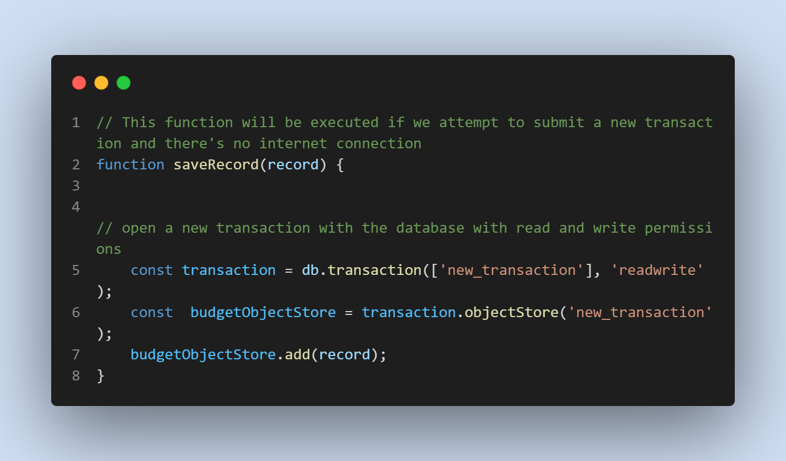
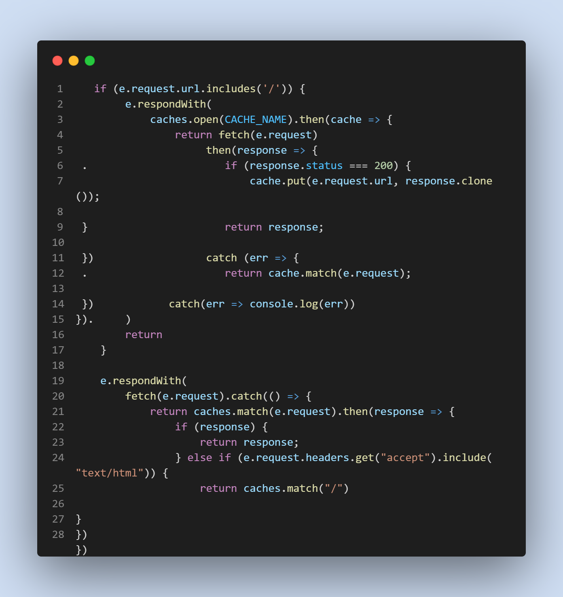

# BudgetTracker

  
 
 
 
 

### Heroku Deployment
.png)

## Description

 * Keep track of all the information for keeping track of the budget including adding or subtracting money from the budget.
 * Building an application that works with or without internet and will cache all data.
 * Connection with MONGO DB opposed to other databases for more documented oriented operations.
 * Heroku is a cloud-based platform that helps companies build, deliver, monitor, and scale applications with high velocity.

# Table of contents
1. [Technologies used](#techologies-used)
2. [Features](#features)
3. [Usage](#usage)
4. [Credits](#credits)
5. [License](#license)

## Technologies used
* Javascript
* Mongoose
* Express
* Node
* Heroku

## Features
* ServiceWorker allow apps to continue functioning offline in case the user loses internet connection
* Heroku deployment 
* MongoDb or document oriented database

## Usage
* Installing necessary dependencies including Express, and Mongoose 
* For developers, run nodemon server.js.

* Screenshots:

## Credits

* [Travis Nichols](https://github.com/travnichols916/BudgetTracker)

## License
[MIT License](https://choosealicense.com/licenses/mit/)

